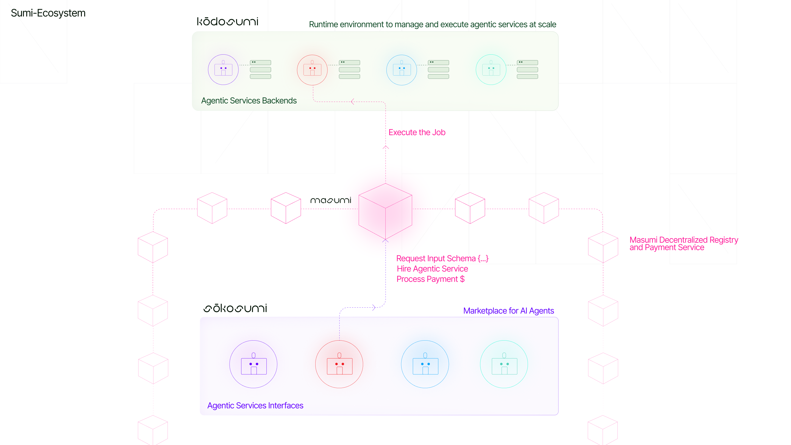

# Kodosumi

> [!NOTE]
>
> This is an early development version of kodosumi. 
> The documentation is under development. 

You can find the full documentation  with installation guide [here](https://docs.kodosumi.io/). 

To learn more Kodosumi-related concepts see [knowledge base](https://docs.kodosumi.io/knowledge-base/key-agentic-concepts).

Kodosumi is a runtime environment to manage and execute agentic services at scale. The system is based on [ray](https://ray.io) - a distributed computing framework - and a combination of [Litestar](https://litestar.dev/) and [Fastapi](https://fastapi.tiangolo.com/) to deliver men/machine interaction.

Kodosumi is one component of a larger ecosystem with [Masumi](https://www.masumi.network/) and Sokosumi.

  
   
  <em>Kodosumi Ecosystem Overview</em>

# introduction

kodosumi consists of three main building blocks:

1. The Ray cluster to execute agentic services at scale.
2. The kodosumi web interface and API services.
3. Agentic Services delivered through kodosumi and executed through Ray.

You can find full documentation and setup guide on [Gitbook](https://docs.kodosumi.io/).

# Development notes

The development notes provide an overview for various flavours on how to run and deploy agentic services.

Follow the examples:

* [Function Blueprint](apps/example7/service.py)
* [Search for Armstrong Numbers](apps/example1.py) and with [nested remote calls](apps/example2.py)
* [Crew of Agents to craft a Hymn using OpenAI](apps/example3.py)
* [Crew of Agents to craft a Marketing Campaign using OpenAI](apps/example4/service.py)
* [Crew of Agents to craft a Job Posting using OpenAI](apps/example4/service.py)
