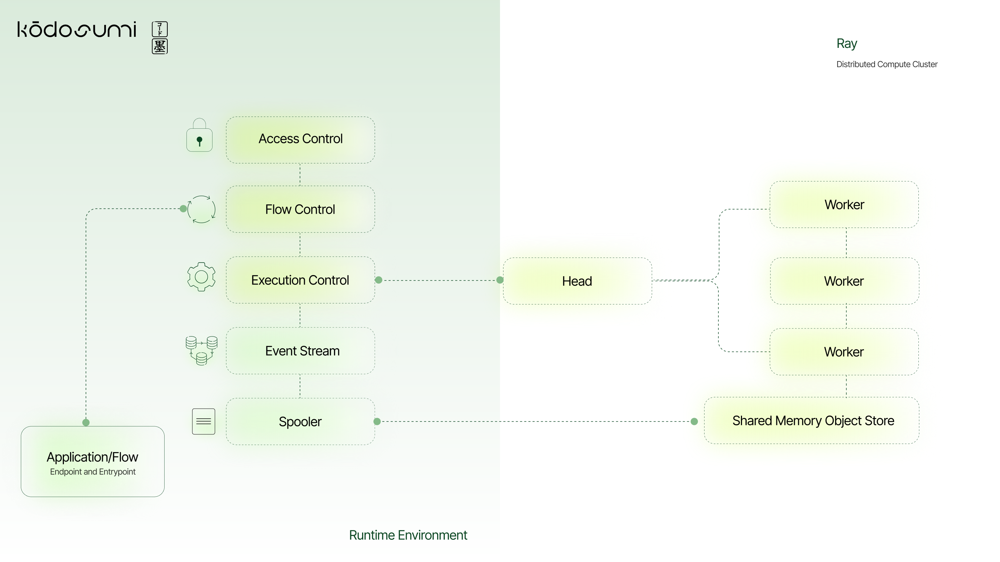

# kodosumi

kodosumi is the runtime environment to manage and execute agentic services at scale. The system is based on [Ray](https://ray.io) - a distributed computing framework - and a combination of [litestar](https://litestar.dev/) and [fastapi](https://fastapi.tiangolo.com/) to deliver agentic services to users or other agents. Similar to Ray, kodosumi follows a _Python first_ agenda.

kodosumi is one component of a larger eco system with [masumi and sokosumi](https://www.masumi.network/).

# introduction

kodosumi consists of three main building blocks. First, a _Ray cluster_ to execute agentic services at scale. kodosumi builds on top of Ray and actively manages the lifecycle and events of service executions from _starting_ to _finished_ or _error_. No matter you name your code an application, flow, service or script: The third building block is _your application_ which runs on top of kodosumi.

The following architecture shows the relation between the three building blocks: 1) your service on top of 2) kodosumi which operates 3) a distributed compute cluster with Ray secure and at scale.



You build and deploy your [Flow](./docs/concepts.md#flow) by providing an [endpoint](./docs/concepts.md#endpoint) (http route) and an [entrypoint](./docs/concepts.md#entrypoint) (Python callable) to kodosumi (left bottom blue box in the diagram). kodosumi delivers features for [access control](./docs/api.md#access-control), [flow control](./docs/api.md#flow-control) and manages [flow execution](./docs/api.md#execution-control) with Ray [head node](./docs/concepts.md#ray-head) and [worker nodes](./docs/concepts.md#ray-worker). [kodosumi spooler](./docs/concepts.md#spooler) gathers flow execution results and outputs into the [event stream](./docs/concepts.md#event-stream).

Deep-dive into [endpoints](./docs/concepts.md#endpoints) and how these translate into [entrypoints](./docs/concepts.md#entrypoints) of [flows](#flows) which operationalize the business logic of [agentic services](#agentic-service) or [agents](#agents) in the broader sense.


# installation

The following quick guide

1. installs kodosumi and all prerequisites
2. starts Ray and kodosumi on your localhost
3. deploys an example flow which ships with kodosumi

This installation has been tested with versions `ray==2.46.0` and `python==3.12.6`.

### STEP 1 - clone and install kodosumi.

```bash
pip install kodosumi
```

The trunk version can be installed from GitHub with

```bash
tbd.
```

### STEP 2 - start ray as a daemon.

```bash
ray start --head
```

Check `ray status` and visit ray dashboard at [http://localhost:8265](http://localhost:8265). For more information about ray visit [ray's documentation](https://docs.ray.io/en/latest).

### STEP 3 - prepare environment

To use [openai](https://openai.com/) or other API you might need to create a local file `.env` to define API keys. This follows the 12 factors to [store config in the environment](https://12factor.net/config).

```
OPENAI_API_KEY=...
EXA_API_KEY=...
SERPER_API_KEY=...
```

### STEP 4 - deploy example app with `ray serve`

Deploy the example application/flow `my_app` in `apps.simple`. Use Ray `serve deploy` to launch the service in your localhost Ray cluster.
```bash
serve deploy apps/config.yaml
```

Please be patient if the Ray serve applications take a while to setup, install and deploy. Follow the deployment process with the Ray dashboard at [http://localhost:8265/#/serve](http://localhost:8265/#/serve). On my laptop initial deployment takes three to four minutes.

### STEP 5 - start kodosumi

Finally start the kodosumi components and register ray endpoints available at 

[http://localhost:8001/-/routes](http://localhost:8001/-/routes).

```bash
koco start --register http://localhost:8001/-/routes
```

### STEP 6 - Look around

Visit kodosumi admin panel at [http://localhost:3370](http://localhost:3370). The default user is defined in `config.py` and reads `name=admin` and `password=admin`. If one or more Ray serve applications are not yet available when kodosumi starts, you need to refresh the list of registered flows. Visit **Routes Screen** at [(http://localhost:3370/admin/routes](http://localhost:3370/admin/routes) in the **Admin Panel** at [http://localhost:3370/admin/flow](http://localhost:3370/admin/flow). See also the **OpenAPI documents with Swagger** [http://localhost:3370/schema/swagger](http://localhost:3370/schema/swagger). 

If all went well, then you see a couple of test services. Be aware you need some OpenAPI, Exa and Serper API keys if you want to use all Agentic Services.

Stop the kodosumi services and spooler by hitting `CNTRL+C` in the corresponding terminal. Stop Ray _serve_ with `serve shutdown --yes`. Stop the ray daemon with command `ray stop`.

# development notes

The development notes provide an overview for various flavours on how to run and deploy agentic services.

Follow the examples:

* [Function Blueprint](apps/example7/service.py)
* [Search for Armstrong Numbers](apps/example1.py) and with [nested remote calls](apps/example2.py)
* [Crew of Agents to craft a Hymn using OpenAI](apps/example3.py)
* [Crew of Agents to craft a Marketing Campaign using OpenAI](apps/example4/service.py)
* [Crew of Agents to craft a Job Posting using OpenAI](apps/example4/service.py)