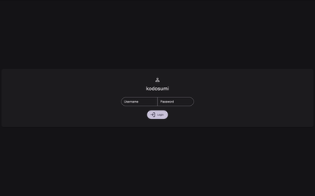
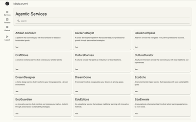
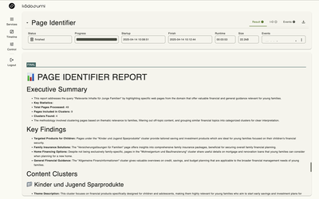
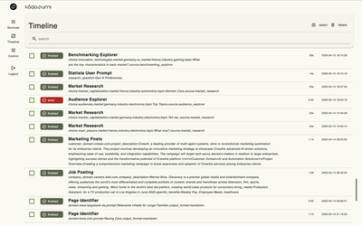

# Kodosumi admin panel

The Kodosumi admin panel provides a simple and pragmatic web interface for managing and monitoring agentic services. Below is a detailed overview of its key features and components.

## Login Screen

The admin panel requires authentication to access. By default, the username is `admin` with password `admin`. These credentials can be configured using environment variables for enhanced security.  See [configuration](./config.md).

## Service Screen

The services page displays a comprehensive list of all agentic services available on the current node. This interface allows users to browse, search and start agentic services.

## Inputs Form

Kodosumi uses standardized inputs schemes to manage user input.

## Status Screen

The status screen provides detailed runtime information of flow execution. The _Results_ tab renders intermediate and final results. The _I-O_ tab provides the flow's `stdio` streams (`stdout`, `stderr` stream and flow _debug_ events). The full event stream is available in tab `Events`. A printable version can be accessed with the download icon.

### Input/Output Streams

### Timeline Screen

## Agentic Control

The control panel serves as the operator interface to reconnect and update agentic services. The Swagger UI to the kodosumi API is linked here, too.
