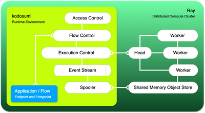

Kodosumi is the runtime environment to manage and execute agentic services at scale. The system is based on [Ray](https://ray.io) - a distributed computing framework - and a combination of [litestar](https://litestar.dev/) and [fastapi](https://fastapi.tiangolo.com/) to deliver agentic services to users or other agents. Similar to Ray, Kodosumi follows a _Python first_ agenda.

Kodosumi is one component of a larger eco system with [masumi and sokosumi](https://www.masumi.network/).

# Introduction

Kodosumi consists of three main building blocks. First, a _Ray cluster_ to execute agentic services at scale. Kodosumi builds on top of Ray and actively manages the lifecycle and events of service executions from _starting_ to _finished_ or _error_. No matter you name your code an application, flow, service or script: The third building block is _your application_ which runs on top of Kodosumi.

The following architecture shows the relation between the three building blocks: 1) your service on top of 2) Kodosumi which operates 3) a distributed compute cluster with Ray secure and at scale.

You build and deploy your [Flow](./concepts.md#flow) by providing an [endpoint](./concepts.md#endpoint) (HTTP route) and an [entrypoint](./concepts.md#entrypoint) (Python callable) to Kodosumi (left bottom box in the diagram). Kodosumi delivers features for [access control](./api.md#authentication), [flow control](./api.md#flow-control) and manages [flow execution](./api.md#execution-control) with Ray [head node](./concepts.md#ray-head) and [worker nodes](./concepts.md#ray-worker). [Kodosumi spooler](./concepts.md#spooler) gathers flow execution results and outputs into the [event stream](./concepts.md#event-stream).

Deep-dive into [endpoints](./concepts.md#endpoint) and how these translate into [entrypoints](./concepts.md#entrypoint) of [flows](#flows) which operationalize the business logic of [agentic services](#agentic-service) or [agents](#agents) in the broader sense.

If you need further background information read [why Kodosumi](./why.md)